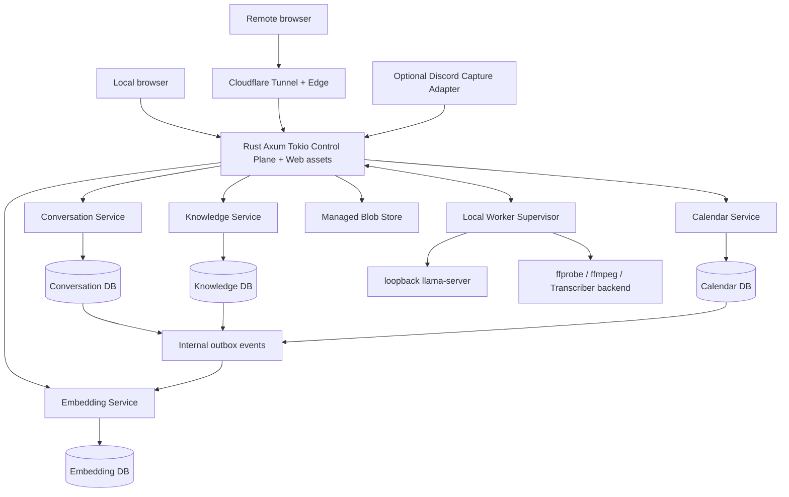

# Architecture

Status: baseline for current lifelogging implementation

Last reviewed: 2026-07-31

## Product Boundary

POV Story의 H0~H5 구현 기반은 독립형 local-first 개인 라이프로깅 웹 챗 앱입니다. 채팅은 하나의 사용자 인터페이스이고, 메모·음성·일정·할 일·작업일지·장기 기억은 앱 내부 domain service와 앱 소유 저장소가 제공합니다.

Discord는 교체 가능한 선택적 capture adapter이며, Obsidian·운영체제 Calendar·MCP를 runtime 정본이나 필수 dependency로 사용하지 않습니다. 인터넷이 없어도 같은 장치의 `127.0.0.1:8080` Web Chat으로 핵심 기능을 사용할 수 있어야 합니다.

회차, 선택, 관계, 세계 상태와 엔딩이 이어지는 storyworld는 별도 제품 가설이 아니라 이 기반 이후의 H6 후속 제품 방향입니다. 현재 문서는 storyworld production architecture를 정의하지 않습니다. 제품 순서는 [ADR-0003](decisions/0003-lifelogging-foundation-and-storyworld-follow-on.md), 사용자와 가치 가설은 [Product Strategy](PRODUCT_STRATEGY.md)를 따릅니다.

## H6 Architecture Boundary

같은 제품 계보가 같은 runtime, DB, account 또는 개인 데이터 공유를 의미하지는 않습니다. [POV-025](tickets/POV-025-storyworld-reader-demand-and-positioning.md)부터 [POV-028](tickets/POV-028-creator-authoring-and-monetization-validation.md)까지 reader·experience·creator evidence를 검토한 뒤, [POV-029](tickets/POV-029-storyworld-architecture-and-safety-decision.md)가 다음 항목을 새 ADR로 결정합니다.

- lifelogging과 storyworld의 account, authorization와 bounded-context 경계
- episode, relationship, world-state source와 생성 가능한 derivative 경계
- 개인 lifelog opt-in, 목적 제한, 격리, 철회, export, deletion과 retention
- local/cloud inference, concurrency, quota, ingress, cache/log와 failure boundary
- moderation, age, copyright, creator ownership, publishing, payment와 settlement

그 결정 전에는 개인 lifelog를 사용하지 않는 synthetic artifact 기반 discovery/prototype으로만 H6를 검증하고 현재 control plane, source DB와 Blob에 storyworld contract를 추가하지 않습니다. participant research data는 별도 consent, access, retention과 deletion plan을 따릅니다.

## System Shape

Cloudflare는 외부 ingress만 담당합니다. local path는 Cloudflare와 인터넷이 없어도 동작해야 합니다. `llama-server`는 loopback에만 bind하고 browser, LAN, Tunnel에 직접 노출하지 않습니다.

## Runtime Baseline

### Implemented Local Surface

- Rust `1.95.0` workspace의 `pov-api` crate가 Axum `0.8.9`와 Tokio `1.53.1`을 사용합니다.
- React `19.2.8`과 Vite `8.1.5` production output을 `rust-embed`로 binary에 포함합니다.
- process는 별도 설정 없이 `127.0.0.1:8080`에만 bind하고 shell과 `GET /api/health`를 same-origin으로 제공합니다.
- [ADR-0006](decisions/0006-h1-development-and-dogfood-platform.md)에 따라 H1의 intended
  always-on backend와 dogfood runtime은 MacBook의 macOS입니다. Windows는 frontend와 Rust
  cross-platform development/validation 환경이지만 production auth maintenance/runtime을
  활성화하지 않습니다. MacBook production runtime과 installed-browser activation evidence는
  장비 확보 뒤 [POV-038](tickets/POV-038-macos-dogfood-runtime-and-installed-browser-evidence.md)이
  소유하며 POV-010 implementation delivery의 완료 조건과 분리합니다.
- `/api/health`는 고정 상태만 반환하며 DB, model, filesystem 상태나 personal data를 읽지 않습니다.
- unknown API path는 SPA로 fallback하지 않고, embedded asset key 밖의 path는 읽지 않습니다.
- `pov-core` crate가 UUID-typed owner ID, 생성·rehydration 시 UUID v4를 검증하는 source/correlation ID, positive checked revision과 opaque verified-owner scope를 제공합니다. shared-receiver async backend-neutral repository port의 모든 read/create/revise operation은 이 scope를 요구하고 opaque backend failure를 표현할 수 있습니다. typed source-store marker는 associated domain을 노출하고 source/derivative 역할을 분리합니다. production owner scope는 `AuthRuntime::verify_access`가 검증한 JWT, active session과 credential version에서만 생성하며 synthetic constructor는 test build로 제한됩니다.
- Conversation, Knowledge, Calendar, Embedding은 고정된 네 SQLite file, typed store handle과 독립 migration namespace를 가집니다. 새 app initialization reservation marker가 없는 미인식 DB는 비어 있는 formatted SQLite까지 채택하지 않습니다. 유효한 reservation도 빈 초기 상태만 복구할 수 있으며 잘못된 store contract, migration exact-prefix·SQL drift와 future version은 app이 WAL mode를 바꾸거나 새 migration을 적용하기 전에 거부합니다. 기존 main file을 처음 열 때 SQLite 자체가 수행할 수 있는 hot-journal/WAL recovery는 이 app-level 거부보다 앞설 수 있으며 직접 검증하지 않았습니다.
- Conversation store의 concrete append repository는 `VerifiedAuthContext`에서만 owner scope를 받고 exact UTF-8 1~64KiB user event를 저장합니다. UUID v4 idempotency key의 fingerprint는 domain/version, owner, target conversation, absent/exact expected revision, event kind와 exact content bytes에서 repository가 계산하며 correlation ID와 content SHA-256도 caller 값이 아니라 actual bytes와 server state에서 생성합니다. 같은 owner/key/fingerprint retry는 revision 검사보다 먼저 기존 receipt를 찾고, 다른 target/revision/content는 generic conflict로 닫습니다.
- 새 append는 `BEGIN IMMEDIATE`에서 conversation revision CAS, immutable event, owner-scoped idempotency mapping, content-free audit와 content를 복제하지 않는 outbox pointer를 함께 commit합니다. event source revision은 immutable `1`, conversation ordinal은 별도 revision입니다. 성공은 commit 뒤 owner-scoped joined readback이 exact content 재해시, fingerprint, correlation, event/outbox/audit 1:1 관계와 `current_revision >= event ordinal`을 검증한 뒤에만 반환합니다. 따라서 commit과 readback 사이에 다음 revision이 commit되어도 첫 성공을 corruption으로 오인하지 않습니다. commit 뒤 response loss는 같은 key retry로 복구하고 rollback/commit state가 불명확한 connection은 autocommit 복구 전까지 재사용하지 않으며 복구 불확실성에는 queued report/backup을 포함한 store operation을 poison합니다. POV-010 delivery는 owner-scoped list/timeline read와 append를 `pov-api`에 wiring하고 production `VerifiedAuthContext`를 `AuthRuntime::verify_access`에서만 전달합니다. Repository acceptance fixture만 synthetic owner를 사용합니다.
- Conversation migration `0003`과 typed queue repository/internal dispatcher surface는 immutable outbox row를 owner-scoped source pointer로 사용합니다. enqueue fingerprint와 ledger는 동일 retry를 같은 job으로 복구하고 다른 request 또는 같은 `(owner, outbox, kind)`의 중복 생성을 거부하며, exact owner/outbox/kind lookup은 enqueue key를 잃은 response-loss 복구 경로를 제공합니다. cancel/resume도 별도 typed mutation key와 immutable fingerprint ledger로 같은 결과를 replay합니다. 현재 policy는 `conversation_response_v1`, fixed normal priority와 durable enqueue sequence FIFO 하나이며 caller가 priority, timeout 또는 retry policy를 주입하지 않습니다.
- durable queue singleton은 generation과 opaque lease token으로 system-wide active attempt를 fence하고 `leased`와 `running`을 구분합니다. job, attempt, cancellation, retry schedule, queue wait, execution duration과 content-free status event는 한 Conversation transaction에서 전이합니다. 입력 대기 상태는 다음 attempt budget이 남은 경우에만 attempt를 끝내고 슬롯을 반납하며, 마지막 attempt의 `waiting_confirmation`은 adapter와 SQL trigger가 함께 거부합니다. `finish` response loss는 같은 held capability와 outcome으로 committed result를 readback하고 stale capability는 mutation 없이 거부합니다. 반면 유실된 claim capability는 재구성하지 않으며 시작되지 않은 lease가 정확한 만료 시각까지 슬롯을 점유하고 attempt 하나를 소비한 뒤 retry 또는 terminal policy로 진행합니다. DB의 마지막 관측 wall-clock보다 뒤인 admission/mutation은 `ClockRegression`으로 fail closed하고 reads는 유지하며, 시간이 그 floor를 따라잡을 때만 재개되고 reset 경로는 없습니다.
- Conversation forward migration `0006`은 적용 시점의 outbox 최대 sequence를 generation
  cursor로 고정해 과거 source를 소급 생성하지 않습니다. capture-only mode도 새 outbox를
  처리하지 않고 cursor만 전진시킵니다. enabled scanner는 요청 경로 enqueue 손실을 복구하며
  `(owner, outbox, conversation_response_v1)`당 job 하나만 보존합니다. provider 성공은 source와
  assistant event, job/attempt, backend/runtime/model revision과 SHA-256, canonical input/output
  SHA-256 및 monotonic elapsed를 잇는 immutable result와 queue success를 하나의 Conversation
  transaction에 commit합니다. result key replay는 같은 assistant event/readback으로 수렴합니다.
- Conversation migration `0004`는 ADR-0004 local auth control plane을 exact `uninitialized` singleton에서 시작합니다. Account/credential/throttle/login-control은 한 owner만 허용하고, fixed one-hour marker와 version-bound outcome, profile별 8 active session, exact local/remote refresh deadline, generation `0..8191`, one-active-token family와 append-only audit를 SQL constraint와 trigger로 방어합니다. Append-only migration `0005`는 throttle row를 0에서 시작하게 하고 실패 횟수별 exact exponential/capped deadline, failure admission boundary, count 100 bound, password terminal state와 recovery 100 saturation을 강제하며 invalid legacy deadline/count에서는 migration 전체를 rollback합니다. Immutable row는 `INSERT OR REPLACE`로 교체할 수 없고 terminal refresh cleanup은 session delete에서 family/token으로 cascade합니다. Schema 자체는 listener나 production owner context를 활성화하지 않으며, 아래 key lifecycle, auth repository, JWT/session verifier와 fail-closed startup이 이를 소비합니다.
- Unix auth instance primitive는 final instance root와 exact `stores/`, `secrets/` directory를 effective UID 소유 `0700`으로만 채택하고 기존 unsafe path를 chmod/chown하거나 symlink를 따라가지 않습니다. 새 root/child는 pinned parent descriptor 기준으로 만들고 parent/root basename 결합과 root/store/secret descriptor의 type, owner, mode, device/inode identity 및 close-on-exec를 lock 전후에 재검증합니다. `secrets/auth-maintenance.lock`은 persistent empty regular file 하나이며 owner-only `0600`, link count 1, no-follow, close-on-exec와 nonblocking exclusive OS lock을 강제합니다. 경쟁 process는 mutation 전에 실패하고 holder crash는 kernel unlock으로 복구되며 exec child는 lock descriptor를 상속하지 않습니다. Layout을 소비해 얻는 locked capability는 open 때 포착한 Conversation DB parent identity가 pinned `stores/` descriptor와 일치할 때만 유지보수 context로 전환되고, exact borrowed store를 explicit revalidation에 고정합니다. Cross-instance store와 같은 DB inode를 옮겨 둔 replacement directory를 거부하며 context가 살아 있는 동안 lock을 보존합니다. Actor admission은 이 context를 Storage만 mint하는 non-Clone binding으로 바꾸고, bounded mailbox를 `blocking_recv`하는 전용 OS thread 하나가 binding과 lock을 함께 소유합니다.
- Typed read-only initialization reconciliation은 held-lock FD와 path identity를 포함한 context 재검증 뒤 bounded raw-basename secret snapshot A와 zeroizing metadata decode를 유지하며 exact bound store의 fresh read-only/private-cache typed initialization lifecycle/source observation A, retained filesystem B, 별도 typed observation B equality와 final filesystem revalidation을 순서대로 수행합니다. Clean DB snapshot은 current migration history와 exact 12-table auth manifest, canonical `uninitialized` singleton, 나머지 auth row와 `auth_audit` sequence residue 부재를 확인합니다. Canonical `initializing` revision/version `1` 또는 `active` revision `2` source는 account/password/recovery 각 1, two throttle, login-control, sole `auth_initialized` audit, marker/outcome/session/family/token 0개와 동일 owner/source timestamp/revision/state/null shape 및 independent verifier salt를 검증하며 `sqlite_sequence`는 `auth_audit` integer `1`에만 scoped합니다. Exact `uninitialized` filesystem은 clean과 여섯 pre-source phase로, metadata와 exact-match하는 sentinel 또는 legacy source 및 intact prepared reservation은 install-temp/active-key/final-lifecycle의 forward-only phase로 분류합니다. Final lifecycle CAS 뒤 exact active key와 intact transition reservation은 `AwaitingCleanupRename`이고, atomic rename 뒤 matching cleanup namespace는 deletion-only `AwaitingCleanupStagedRemoval|AwaitingCleanupPreparedRemoval|AwaitingCleanupMetadataRemoval|AwaitingCleanupDirectoryRemoval`로 재개합니다. Exact active revision `2`/keyring version `1`, canonical active key와 lock+active-key-only namespace는 `InitializationComplete`이지만 metadata가 이미 제거됐으므로 active lifecycle/KID/version/key/namespace만 확인하는 terminal protocol state이지 metadata-backed full mutable-source proof나 listener readiness가 아닙니다. Exact `no-blocklist-check-v1` sentinel의 linked complete pre-source만 resume-or-rollback candidate이고 모든 legacy pre-source는 rollback-only이며 exact legacy post-source는 rewrite 없이 forward-only입니다. Canonical metadata/DB provenance mismatch, unknown/noncanonical artifact, active+temp, mismatched cleanup과 unsupported lifecycle은 evidence를 보존한 blocked result이고 seed shape 손상, malformed lifecycle, unsafe artifact, typed initialization observation A/B 또는 final filesystem drift와 schema/identity/rollback/close 불확실성은 store와 actor를 poison합니다. Unsupported `Active|Transitioning`은 lifecycle facts만 비교한 뒤 block하며 그 state의 mutable auth row를 whole-DB snapshot으로 비교하지 않습니다. 기존 clean API는 `CleanUninitialized`만 `Clean`으로 map합니다.
- Crate-private initialization preparation command는 exact clean reconciliation과 immediate namespace recheck 뒤 no-replace reservation, canonical metadata, matching staged keyring과 empty prepared sentinel을 owner-only no-follow exclusive create/readback과 file/directory fsync로 내구화합니다. 별도 no-payload pre-source recovery command는 exact `uninitialized` DB와 policy sentinel `StagedComplete|Prepared`/`ResumeOrRollbackCandidate`만 채택해 retained metadata와 staged keyring을 다시 durabilize하고 missing empty `prepared`를 exclusive-create하거나 existing sentinel을 rewrite 없이 durabilize한 뒤 exact `Prepared`로 재검증합니다. Redacted result는 `Prepared|AlreadyPrepared|NotRecoverable`이며 ineligible state는 mutation 없이 보존합니다. 별도 no-payload pre-source rollback command는 exact clean DB와 legal initialize reservation만 대상으로 cleanup namespace를 만들지 않고 `prepared → staged-keyring → metadata → transition directory` 역순 exact-path unlink/fsync를 수행합니다. 최초 verified transition ID, reservation inode와 original file FD/content를 terminal readback까지 유지하고 각 fresh snapshot이 같은 reservation의 predicted subset인지 검증합니다. 따라서 모든 durability checkpoint가 기존 `Prepared → StagedComplete → MetadataComplete → ReservationOnly → CleanUninitialized` phase에 남고 sentinel/legacy metadata를 명시적으로 rollback할 수 있습니다. DB lifecycle/auth row/audit와 active key는 바꾸지 않으며 redacted `RolledBack|AlreadyClean|NotRollbackable`로 닫습니다. No-payload source command는 exact sentinel `Prepared`에서만 metadata-owned source를 `initializing` revision/version `1`로 CAS하고, DB writer 전에 metadata, staged keyring과 prepared sentinel을 각각 file/reservation-directory fsync해 exact identity/content와 phase를 다시 확인합니다. No-payload active-key install command는 exact canonical sentinel 또는 legacy source와 intact staged evidence에서 derived install temp를 create/recover/durabilize한 뒤 atomic `NOREPLACE` rename으로 `auth-keyring.v1`에 publish합니다. 이어지는 no-payload final lifecycle command는 exact installed active, intact reservation/staged/prepared와 full canonical source를 재검증하고 one `BEGIN IMMEDIATE`에서 lifecycle만 `active`, revision `2`로 CAS하며 transition kind/ID를 `NULL`로 만듭니다. Expected KID, keyring version과 metadata의 기존 source timestamp는 그대로 보존하고 새 clock을 도입하지 않습니다. Exact replay는 source/audit/key file을 다시 쓰지 않고 `AlreadyActivatedAwaitingCleanup`으로 수렴하며 reservation evidence를 `AwaitingCleanupRename`에 intact하게 남깁니다. 이어지는 no-payload initialization cleanup command는 exact active/source/key/reservation을 다시 검증한 뒤 transition directory를 derived cleanup basename으로 atomic no-replace rename하고 secret parent를 fsync합니다. Cleanup namespace는 initialization install temp를 허용하거나 지우지 않고 staged, prepared, metadata, directory만 exact-path로 순서대로 제거하며 각 containing directory를 fsync합니다. DB lifecycle/source/audit와 active key는 바꾸지 않고 success/replay는 redacted `Completed|AlreadyCompleted`, 다른 state는 `NotCleanable`로 닫습니다.
- Preparation/pre-source-recovery/pre-source-rollback/source/install/final-lifecycle/cleanup command는 mutation 직전과 반환 직후 retained filesystem/context를 다시 검증하고, admitted reply receiver가 drop되어도 actor work를 취소하지 않습니다. Recovery success/replay와 source-CAS/rollback next step, ineligible no-mutation, metadata/staged/prepared recovery durability fault와 fresh-actor resume, source/namespace/hardlink/reservation-ABA/post-create drift, source-CAS three-file durability fence failure, response loss, confirmed no-commit/retry, exact replay, current/historical source, same/different-source race, rollback reverse-order checkpoint, cleanup rename과 staged/prepared/metadata/directory fsync checkpoint, durability failure와 post-mutation drift poison을 synthetic tests로 검증합니다. Per-command panic, identity/filesystem drift와 infrastructure/durability uncertainty는 partial evidence를 자동 정리하지 않은 채 shared operation을 poison하고, unknown/noncanonical/illegal partial state는 보존한 채 manual fail closed합니다. Actor는 ownership 동안 lock을 보유하고 explicit shutdown은 thread를 join하며, normal mailbox pressure와 receiver drop은 poison하지 않습니다. Exclusive lock은 cooperative이며 rename/unlink 직전 또는 final postcheck 직후 malicious same-UID ABA를 원자적으로 배제하지 않고 이미 끝난 namespace mutation을 되돌리지 않습니다. Synthetic fsync fault는 실제 abrupt process termination, power-loss 또는 filesystem별 atomicity/durability evidence가 아니며 unsupported backend는 fail closed합니다. Unlink는 copy-on-write, journal 또는 snapshot에서의 physical secure erase를 보장하지 않습니다. Initialization과 planned/retire core는 production auth repository/JWT/session/HTTP/runtime에 연결됐고 `auth init` operator가 노출됩니다. Planned/retire operator, compromise/loss와 platform/durability residual은 POV-035~037로 분리합니다.
- lease 만료 시각 자체부터 capability는 expired입니다. 시작하지 않은 expired lease는 이전 attempt를 보존한 채 retry budget에 따라 다시 runnable 또는 terminal이 될 수 있습니다. 시작한 `running`/`cancel_requested` attempt의 lease가 만료되면 이전 실행의 부재가 입증되지 않았으므로 자동 재실행하지 않고 durable `recovery_required`로 전환해 모든 새 claim을 막습니다. explicit confirmed-stopped resolution만 retry 또는 terminal state로 슬롯을 해제합니다. global event sequence와 비공개 result-append key는 각각 이후 replay cursor와 assistant append 재시도에 예약되어 있으며, 이 persistence core에는 실제 process-absence proof, background dispatcher loop와 provider 호출이 포함되지 않습니다.
- 각 SQLite handle은 `tokio-rusqlite` 전용 thread에서 직렬 실행하며 WAL, `synchronous=FULL`, foreign key, `recursive_triggers=ON`, 5초 busy timeout, `trusted_schema=OFF`, cell-size check, defensive mode와 `quick_check`를 open/reopen마다 검증합니다. recursive trigger policy는 `INSERT OR REPLACE`의 implicit delete가 append-only trigger를 건너뛰지 못하게 합니다. migration 전에 설치한 connection authorizer는 항상 `ATTACH`/`DETACH`를, migration SQL에서는 transaction/savepoint 제어와 value-setting PRAGMA를 거부합니다. migration transaction은 commit 직전에 전체 current history를 다시 검증합니다.
- Unix 계열에서 전용 app-owned store directory, DB와 initialization marker는 current effective UID 소유이며 각각 owner-only `0700`, `0600`이어야 합니다. 새 경로는 그 mode로 만들고, 기존의 잘못된 owner/mode directory를 임의로 chown/chmod하거나 root symlink와 DB symlink/hard-link alias를 따라가지 않고 거부합니다. pre-dispatch reservation guard drop은 current attempt가 예약한 main/marker를 정리하고, synthetic interrupted-empty 또는 committed-with-leftover-marker state는 다음 open에서 복구합니다. initialization marker는 recovery token이지 exclusive lock은 아니므로 concurrent opener와 creator cleanup의 경합은 runtime wiring 전에 해결해야 합니다. main/destination이 없을 때 preflight에서 발견한 orphan sidecar는 삭제하지 않고 거부하며, current attempt가 main을 예약한 뒤 생긴 conventional sidecar path는 failure cleanup 대상입니다.
- store별 online backup hook은 Unix owner-only directory에 새 destination만 만들고 row, store contract, 전체 current migration history와 integrity를 다시 검증하며 실패한 partial artifact cleanup 오류도 보고합니다. dispatch된 SQLite backup은 호출 future가 취소되어도 worker에서 완료될 수 있습니다. queue singleton admission에는 같은 DB를 여는 두 child process의 synthetic claim test가 있지만, 일반 store open/backup/creator lifecycle의 실제 task abort, subprocess/power-loss와 multi-process contention은 검증하지 않았습니다. encryption, retention, multi-store atomic publication, restore와 production instance-root 선택/wiring은 아직 결정하거나 구현하지 않았습니다.
- PostgreSQL은 네 개의 별도 migration namespace와 `NotImplemented` 상태만 정의하며 driver, SQL 또는 adapter를 구현하지 않습니다.
- `pov-core`의 one-shot `ProcessSupervisor`는 typed executable ID를 app-owned canonical Mach-O/ELF path에 매핑합니다. trusted root부터 executable까지 owner/mode/identity와 actual-byte SHA-256을 등록 시와 실행 직전에 검증하고 PATH lookup, relative path, symlink, hard link, writable hierarchy와 nonnative image를 거부합니다. child는 fixed argv, cleared fixed environment, null stdin과 owner-only `0700` attempt directory에서 shell 없이 실행합니다.
- stdout/stderr는 stream별 유한 byte cap으로 동시에 drain하며 short-exit overflow도 최종 drain outcome과 합성합니다. timeout, cancellation, output failure, caller future abort와 자연 종료 모두 lifecycle actor가 POSIX process group을 강제 종료하고 direct PID/group absence를 확인한 뒤 attempt를 blocking pool에서 bounded cleanup합니다. 현재 Rust process 안의 모든 supervisor instance가 permit 하나를 공유하고, cleanup이 불확실하면 process supervisor를 재시작 전까지 poison하여 다음 attempt를 거부합니다.
- macOS synthetic evidence는 literal argv와 exact child environment, success, spawn/non-zero/signal, timeout/cancel, caller abort, dual-pipe pressure/overflow, direct/descendant PID·PGID 소멸, symlink-safe attempt cleanup과 executable hierarchy/hash drift를 재현합니다. non-Unix backend는 fail closed입니다. Windows Python Whisper path는 [POV-033](tickets/POV-033-windows-python-whisper-turbo-provider.md)의 executable trust와 Job Object evidence 전까지 활성화하지 않습니다. same-account verify-to-exec race, process group을 벗어나는 daemon, supervisor/runtime 자체의 abrupt termination, CPU/memory/fd/work-byte quota는 이 contract가 해결했다고 주장하지 않습니다.
- `pov-api`는 explicit instance root에서 `StoreSet`과 fail-closed `AuthRuntime`을 listener bind
  전에 열고 React/Vite shell, health와 local auth HTTP surface를 same-origin으로 제공합니다.
  POV-010 delivery는 access-verified `GET /api/conversations`,
  `GET /api/conversations/{conversation_id}`와 idempotent
  `POST /api/conversations/{conversation_id}/events`를 추가합니다. Queue endpoint,
  Knowledge/Calendar domain adapter, Blob, background dispatcher/worker, SSE, 실제
  provider/model과 external ingress는 아직 구현하지 않았습니다.

### Control Plane

- Rust stable, Axum, Tokio 기반 모듈러 모놀리스
- 인증, conversation append, routing, approval, queue, lease, retry, audit 담당
- React/TypeScript/Vite production asset과 REST/SSE를 same-origin으로 제공
- 운영 환경에 Node/Nuxt/Nitro SSR server를 두지 않음
- 모델이 DB나 filesystem을 직접 변경하지 않고 domain command를 통해서만 mutation

### Web Client

- React, TypeScript, Vite 정적 SPA
- 현재 local same-origin API만 사용하며 remote ingress는 구현하지 않음
- 외부 CDN runtime dependency 없이 app asset에 포함
- access token은 React memory에만 두고 refresh cookie는 HttpOnly local auth path에 한정
- service worker/PWA cache는 아직 구현하지 않음
- API, auth, SSE, upload, audio, conversation, search result는 cache하지 않음

### Worker And Process Supervision

- Windows와 macOS worker는 capability 중심 protocol 사용
- MVP는 control plane과 worker를 한 장치에 둘 수 있음
- generation과 embedding은 장기 실행 loopback `llama-server`
- `ffprobe`, `ffmpeg`와 platform-selected Whisper adapter는 작업별 child process
- core provider port는 backend/runtime build/artifact revision과 actual artifact/input byte SHA-256, monotonic elapsed를 결과 provenance로 보존하며 deterministic synthetic fake로 model-independent contract test를 제공합니다.
- long-running generation provider는 첫 job에서 canonical executable/model과 actual SHA-256을
  다시 확인한 뒤 exact IPv4 `127.0.0.1`, single slot, 8K context, reasoning/tools/prompt-cache
  off와 매 실행 ephemeral API key로 lazy-start합니다. Health와 exact single model identity가
  일치해야 readiness가 되고 port collision이나 foreign identity는 채택하지 않습니다.
  provider port를 Axum, browser, LAN 또는 Tunnel route로 직접 공개하지 않습니다.
- one-shot process는 typed registry의 pinned native executable과 fixed argument array만 사용하고 runtime request에는 path, cwd, environment 또는 stdio 선택을 노출하지 않음
- cleared environment, owner-only attempt, bounded dual-pipe drain, timeout/cancellation, final process-group kill/absence, exit status와 executable hash를 typed report로 기록
- POV-012 background worker는 Conversation DB scanner와 fenced single-slot dispatcher를 long-running
  provider에 연결합니다. lease renew와 cancel을 polling하고 crash/timeout/unavailable을 durable
  retry/terminal state로 기록합니다. cancel, timeout 또는 crash 뒤 process-group absence를 확인한
  뒤에만 다음 실행을 허용하며 확인할 수 없으면 `cleanup_uncertain`/`recovery_required`로 전체
  queue를 중단합니다. graceful shutdown은 worker/provider join 뒤 store를 닫습니다.
- worker는 typed queue/source repository만 사용하고 request payload나 model output에서 owner
  authority를 만들지 않습니다.

Gemma GGUF, KURE-v1과 platform별 Whisper multilingual runtime/model은 benchmark 대상인
versioned narrow 후보입니다. POV-012 actual-model 왕복은 한 Gemma 후보의 protocol/runtime
compatibility만 증명하며 release default나 품질 gate를 결정하지 않습니다. Windows의 Python OpenAI Whisper `large-v3-turbo.pt` 경로는
POV-033이 검증할 compatibility 후보이며, 품질·메모리·latency gate 전에는 release
invariant가 아닙니다.

## Data Ownership

| Store | Canonical data | Notes |
| --- | --- | --- |
| Conversation DB | user/assistant/tool events, runs, jobs, approvals, audit, media metadata, transcript revisions | append-oriented source event store |
| Knowledge DB | notes, daily notes, tasks, worklogs, memory candidates/claims, prompt profiles | curated knowledge source |
| Calendar DB | calendar days, events, recurrence, notification, revisions | only calendar source of truth |
| Embedding DB | chunks, vectors, model/chunker metadata | disposable, reproducible derivative |
| Blob store | temporary audio, attachments, processing output | object retention and purge policy |

MVP는 `rusqlite` 기반 네 개의 SQLite WAL file로 시작합니다.

- DB별 schema, migration, backup, blocking executor 경계를 둡니다.
- `foreign_keys`, WAL, `busy_timeout`, integrity policy를 명시합니다.
- 한 DB table을 다른 DB에서 직접 join하지 않습니다.
- `owner_id`, source domain/ID/revision, correlation ID로 연결합니다.
- source transaction과 outbox event를 함께 commit합니다.
- consumer는 at-least-once delivery에서 idempotent해야 합니다.
- Embedding 장애가 source write를 막지 않아야 하며 전체 index를 source DB에서 재생성할 수 있어야 합니다.
- PostgreSQL adapter와 migration은 SQLite 구현과 분리하고 동일 domain contract test를 통과해야 합니다.

## Identity, Authentication, And Streaming

[ADR-0004](decisions/0004-local-authentication-and-session-security-contract.md)가 auth/session 계약을 accepted했습니다. account, password/recovery verifier, durable throttle, login-attempt marker/outcome, session, active refresh family/predecessor와 auth audit source는 Conversation DB의 control-plane auth namespace에 두고 signing private key는 DB 밖 owner-only secret directory에 둡니다. Migration `0004`/`0005` schema, private auth mutation executor, credential primitive, canonical keyring과 initialization/planned/retire transition lifecycle, Unix instance-directory/maintenance-lock/store-binding actor, strict JWT, login/refresh/logout/logout-all과 credential/account mutation repository, fail-closed `AuthRuntime`, local HTTP/cookie profile 및 controlling-TTY `auth init` operator가 구현됐습니다. [POV-007](deps/POV-007-local-login-refresh-and-session-revoke.md)은 2026-07-29 narrowed local-auth runtime boundary의 supported-Unix production smoke와 final validation을 완료했습니다. Planned/retire production operator는 [POV-035](tickets/POV-035-planned-key-rotation-and-retirement-operator.md), compromise/loss recovery는 [POV-036](tickets/POV-036-auth-key-compromise-and-loss-recovery.md), platform/durability evidence는 [POV-037](tickets/POV-037-auth-platform-and-durability-hardening.md), MacBook installed-browser auth evidence는 [POV-038](tickets/POV-038-macos-dogfood-runtime-and-installed-browser-evidence.md)이 소유합니다.

`storage/auth_records.rs`, 이를 소비하는 storage binding/type과 crate-private transition
re-export는 Unix에서만 compile됩니다. Windows는 Conversation migration `0004`/`0005`와
canonical auth schema를 계속 적용하지만 auth maintenance capability를 compile하거나
성공 stub으로 제공하지 않습니다. [POV-034](deps/POV-034-restore-windows-workspace-validation-baseline.md)는
이 경계를 Windows workspace와 Unix auth synthetic suite에서 검증했습니다.

- 초기 인증은 exact immutable ASCII `[a-z][a-z0-9_-]{2,31}` login ID/password와 one-time saved recovery code이며 TOTP/WebAuthn, browser/email recovery와 public signup은 현재 범위 밖입니다. Login ID는 internal owner UUID와 분리하고 trim, case-fold, Unicode alias를 허용하지 않습니다.
- password는 NFC 뒤 15~128 Unicode code point이고 exact Argon2id v19 `64 MiB / t=3 / p=4`를 사용합니다. Password corpus, caller-supplied context enforcement, embedded digest와 network lookup은 current tree에 없으며 새 password는 보존된 grammar와 verifier 계약으로만 처리합니다. Login과 모든 current-password 재검증은 하나의 durable exponential throttle을 공유합니다. Saved recovery code는 exact `povrec1_` + canonical 16-byte base64url payload와 independent-salt same-profile PHC만 허용합니다. 구현된 primitive는 raw secret buffer를 consume해 drop 때 zeroize하고 PHC algorithm/version/parameter/salt/output와 canonical encoding을 검증한 뒤에만 Argon2를 실행합니다. Password/recovery KDF는 process-wide permit 하나를 `try_acquire`하며 caller cancellation 뒤에도 blocking worker가 끝날 때까지 permit을 보유합니다.
- access JWT는 EdDSA/Ed25519, explicit `typ`, pinned issuer/profile-specific audience/key와 10분 lifetime만 허용합니다.
- Canonical keyring v1은 magic `POVKEYR\0`, big-endian format/total length, positive SQLite-range keyring version, active cutover time, Ed25519 public key, zeroize-on-drop buffer가 소유하는 signing seed, 43-byte RFC 7638 `kid`, optional verify-only public record와 trailing SHA-256을 exact order로 encode합니다. Active-only bytes는 170, verify-only 포함 bytes는 261로 고정하며 decode는 trailing/unknown variant, checksum mismatch, zero seed, weak/public-seed mismatch, noncanonical or recomputed-`kid` mismatch, duplicate key, clock/range overflow와 exact 11-minute overlap 위반을 거부합니다.
- Pure transition contract는 active basename `auth-keyring.v1`, five-kind transition/cleanup과 derived install-temp의 lowercase hyphenated RFC 4122 UUID v4 grammar, reservation의 exact 세 entry를 type으로 고정합니다. Initialization metadata v1은 versioned/checksummed 최대 512-byte binary format이며 canonical active-only keyring v1의 actual 170 bytes에서 result KID/version/key activation과 staged SHA-256을 계산하고, 별도 source timestamp가 key activation보다 빠르지 않게 강제합니다. UUID v4 transition/owner/audit ID, exact login, canonical independent-salt password/recovery PHC를 보존합니다. Compatibility wire slot과 migration `0004`의 persisted column은 유지하지만 application에서는 legacy policy provenance로 취급하며 신규 metadata/DB write는 exact `no-blocklist-check-v1` sentinel만 생성합니다. Stage 검증은 owned bytes의 length/hash뿐 아니라 strict keyring decode와 version/KID/activation cross-check까지 수행합니다. Planned/retire/compromise/loss metadata tag는 kind-specific source-CAS payload가 accepted될 때까지 encode/decode하지 않습니다. Codec 자체는 pure primitive이며 actor-owned preparation layer가 받는 `InitializationPreparationV1` construction은 zero source timestamp를 거부한 뒤 maintenance lock 아래 initialization reservation과 staged/prepared artifact persistence에 사용됩니다. Sentinel metadata만 borrowed redacted initialization source seed를 만들고 actor-owned command가 exact `Prepared` source-CAS에 사용합니다. Exact sentinel 또는 legacy post-source metadata는 derived install temp와 staged keyring bytes를 결합해 initialization active-key install, final lifecycle CAS와 deletion-only cleanup rename의 forward-only evidence로 사용합니다. Atomic `NOREPLACE` active-key install, exact final lifecycle CAS와 initialization cleanup primitive는 구현됐지만 non-initialization transition persistence는 활성화하지 않습니다.
- signature와 claim만으로 owner scope를 만들지 않습니다. exact Host profile, matching token audience, active account, active `sid`, matching owner, credential version과 session profile을 server source에서 확인한 auth verifier만 production `VerifiedAuthContext`를 발급합니다.
- refresh token은 32-byte opaque random value이며 server에는 SHA-256 digest와 rotation family 관계만 저장합니다. 사용마다 atomic rotate하고 predecessor replay나 concurrent reuse는 해당 session family를 terminal-delete합니다. Active family는 generation `0..8191`만 발급하고 cap/revoke/idle-expiry 시 session/family/per-token rows를 모두 제거합니다. Startup과 login/refresh admission은 expired family rows를 먼저 prune합니다.
- local refresh session은 7일 idle/30일 absolute, remote는 12시간 idle/7일 absolute입니다. local HTTP와 remote HTTPS는 cookie name, flags와 family profile을 섞지 않습니다.
- signing key file과 Conversation DB expected key/session state는 distributed transaction으로 묶지 않습니다. Auth bootstrap은 explicit `uninitialized` DB sentinel과 auth/key/transition/cleanup/install-temp artifact 부재가 모두 맞을 때만 owner-invoked maintenance command로 실행합니다. Listener를 닫고 child에 상속되지 않는 OS exclusive lock을 보유한 채 kind/ID reservation, derived install temp, lifecycle compare-and-set과 atomic cleanup-namespace rename으로 initialization/planned/retire/compromise/loss crash를 resume하거나 허용된 pre-source rollback으로 처리합니다. 구현된 pre-source recovery는 exact clean `uninitialized` source와 policy sentinel `StagedComplete|Prepared` reservation만 채택해 metadata/staged/prepared evidence를 다시 durabilize하고 exact `Prepared`로 수렴하며, legacy와 다른 stable state는 mutation 없이 `NotRecoverable`로 닫습니다. 구현된 pre-source rollback은 exact clean `uninitialized` source에서만 initialize transition 내부의 known artifact를 creation 역순으로 exact-remove/fsync하고 cleanup namespace를 만들지 않으며 DB와 key를 변경하지 않습니다. 구현된 initialization source-CAS는 open 때 검증한 Conversation DB의 device/inode/owner identity를 고정하고 `NOFOLLOW` private-cache fresh writer에서 current migration history와 exact 12-table auth inventory를 확인합니다. DB writer 전에 metadata, staged keyring과 prepared sentinel을 각각 file/reservation-directory fsync하고 exact retained identity/content와 `Prepared` phase를 다시 확인합니다. One `BEGIN IMMEDIATE`에서 exact empty `uninitialized` predicate를 `initializing` revision/version `1`로 바꾸고 account, password/recovery credential, 두 throttle, login-control과 sole `auth_initialized` audit를 canonical metadata source로 생성한 뒤 full initialized source를 commit 전에 재검증합니다. Commit 전 exact CAS miss는 같은 transaction에서 typed `AlreadyCommitted|PreconditionChanged`로 분류하고 store/history 재검증, rollback과 writer close가 모두 성공한 뒤에만 committed-view classifier 없이 반환합니다. COMMIT 결과가 불명확하면 active transaction을 rollback하고 statement cache와 writer를 명시적으로 닫은 뒤 별도 fresh read-only private-cache connection에서 full clean precondition 또는 full canonical initialized source를 판정해 `Committed|ConfirmedNotCommitted`로 닫습니다. SQL/history/rollback/close failure, identity drift, readback ambiguity와 worker panic을 포함한 모든 executor `Err`는 shared store operation을 poison하며 caller cancellation은 이미 시작한 blocking quiescence/readback을 중단하지 않습니다. 이어지는 active-key install command는 canonical forward-only source를 매 phase 다시 확인하고 absent/prefix/exact install temp를 create, exact-delete/recreate 또는 exact-reuse하며 file과 directory fsync 뒤 `NOREPLACE` publish를 수행합니다. Exact active replay는 idempotent하게 durabilize하고 lifecycle은 final CAS 전까지 `initializing`으로 남깁니다. Final lifecycle command는 exact installed active와 intact reservation/staged/prepared 및 full canonical sentinel 또는 legacy source를 다시 확인한 뒤 one `BEGIN IMMEDIATE`에서 exact `initializing` revision `1`을 `active` revision `2`로 CAS하고 transition kind/ID만 `NULL`로 만듭니다. KID, keyring version과 source timestamp를 보존하고 이 metadata source timestamp를 lifecycle `updated_at_micros`로 계속 사용하므로 새 completion clock은 없습니다. COMMIT uncertainty는 source-CAS와 같은 fresh committed-view 분류로 `Committed|ConfirmedNotCommitted`를 닫고 exact active replay는 audit/key/file rewrite 없이 `AlreadyCommitted`로 수렴합니다. 성공 뒤에도 original reservation/staged/prepared evidence는 `AwaitingCleanupRename` phase로 보존됩니다. Initialization cleanup command는 exact active revision `2`/version `1`, canonical active key와 full sentinel 또는 legacy source를 확인한 뒤 transition directory를 derived cleanup name으로 atomic no-replace rename하고 parent를 fsync합니다. Cleanup namespace에서는 install temp를 허용하거나 삭제하지 않고 staged, prepared, metadata와 directory를 순서대로 exact-remove/fsync하며 source/audit/active key를 바꾸지 않습니다. Metadata 제거 전에는 full source expectation을 유지하지만 이후 empty cleanup과 terminal replay는 active lifecycle/KID/version/key/namespace의 좁은 envelope만 검증합니다. `InitializationComplete`나 `Completed|AlreadyCompleted`는 auth repository validity 또는 listener readiness가 아니며 startup이 이를 별도로 검증해야 합니다. 이 crate-private primitive 자체는 listener-ready auth state를 증명하지 않지만 initialization 경로, production auth/JWT/session/HTTP/runtime은 POV-007에서 연결됐습니다. Planned/retire production operator와 compromise/loss는 POV-035/036까지 비활성입니다.
- login/session issue, logout, password/recovery/account mutation은 필요한 version, session revoke와 refresh state를 Conversation DB source transaction에 commit한 뒤에만 token, issue/clear cookie 또는 success response를 냅니다. Login response-loss는 fixed one-hour admission marker와 version-bound outcome payload, profile별 64 marker와 independent 8-session cap으로 제한합니다. Failure commit도 observed credential/account versions를 recompare하고, logout-all을 포함한 credential version 변경은 outcome payload만 무효화하며 fixed-expiry marker는 보존합니다. Uncertain commit은 writer를 abandon한 fresh committed-view로만 판정하고 terminal stale cookie는 healthy DB 확인 뒤 idempotent clear합니다.
- local cookie는 exact `http://127.0.0.1:8080`의 host-only `pov_refresh_local`, `HttpOnly`, `SameSite=Strict`, `Path=/api/auth`이며 `Secure`가 없습니다. cookie가 port-isolated가 아니라는 residual risk를 accepted합니다.
- remote cookie는 one configured HTTPS origin의 `__Host-pov_refresh`, `Secure`, `HttpOnly`, `SameSite=Strict`, `Path=/`입니다. Cloudflare trusted-ingress evidence 전 remote auth profile은 비활성입니다.
- browser auth mutation은 POST JSON, exact Origin/Host, `X-POV-CSRF: 1`, same-origin Fetch Metadata를 요구하고 CORS와 access-cookie fallback을 열지 않습니다.
- access token은 browser memory에만 두고 Web Storage, IndexedDB, cookie와 URL에 저장하지 않습니다. REST, SSE와 upload는 Authorization Bearer JWT를 사용합니다.
- 상태 stream은 native EventSource 대신 bearer header를 넣는 fetch streaming SSE를 사용합니다. expiry 전에 닫고 refresh 뒤 durable cursor로 재연결하며 active session을 최대 15초마다 다시 확인합니다.
- 완료된 POV-011은 migration `0003`의 immutable global event sequence를 owner-scoped
  canonical decimal cursor로 읽고, 128-event JSON polling과 fetch-streaming SSE에서 동일한
  content-free payload를 제공합니다. SSE는 500ms page poll, 10초 heartbeat와 별도
  background task 없는 drop-cancellable state를 사용하며 client는 cursor만
  sessionStorage에 보존하고 token은 memory 밖에 저장하지 않습니다. 이 구현과 Chromium
  evidence에 더해 `auth/operator.rs`의 Linux-only `Termios.line_discipline` 비교를 target
  gate로 제한해 actual macOS locked check와 재실행 full test가 PASS했습니다. Linux에서의
  제품 사용과 runtime 지원은 제공하지 않으며 Linux/WSL 검증은 선택적 개발 호환성
  증거일 뿐 POV-011 completion gate가 아닙니다. Target MacBook production activation은
  POV-038의 별도 evidence 경계입니다.
- auth/API/SSE/upload response는 cache하지 않고 password, recovery code, auth header, cookie와 token을 application/proxy/audit/panic log에서 redact합니다.

## Job And Mutation Model

- MVP 전체에서 동시에 RUNNING인 작업은 하나입니다.
- 같은 priority 안에서는 FIFO입니다.
- 사용자 확인 대기 상태는 실행 slot을 점유하지 않습니다.
- queue wait와 execution latency를 별도로 측정합니다.
- 모든 mutation은 target, expected revision, idempotency key를 검증합니다.
- 정책상 approval이 필요한 작업은 immutable proposal snapshot을 사용합니다.
- commit 뒤 같은 record를 다시 읽어 postcondition을 검증합니다.
- partial success와 worker offline을 일반 오류로 숨기지 않습니다.

기준 성능 목표는 MacBook Pro M4 Pro 24GB에서 queue wait 제외 일반 작업 P95 5분, 음성 작업 P95 `5분 + 재생 길이`입니다. 이 값은 실제 benchmark로 검증해야 합니다.

## First Product Milestone

`MVP Voice Lifelog Round Trip`은 다음 전체 왕복을 검증합니다.

1. local Web Chat에서 음성을 접수합니다. Discord는 local core가 검증된 뒤 추가할 수 있는 선택적 capture adapter입니다.
2. 인증된 upload session과 최대 32MiB chunk 후보로 임시 Blob을 완성합니다.
3. Conversation DB에 media metadata와 job을 idempotent하게 기록합니다.
4. `ffprobe` → `ffmpeg` → platform-selected Whisper multilingual provider를 수행합니다.
5. 사용자 교정을 새 immutable transcript revision으로 기록합니다.
6. KURE 후보, FTS5, normalized vector BLOB, Rust exact cosine으로 증분 검색합니다.
7. raw audio를 기본 7일 뒤 idempotent하게 purge합니다.
8. 다음 날 질의에서 현재 transcript revision을 근거로 답합니다.

이 milestone은 [POV-002](tickets/POV-002-voice-lifelog-round-trip.md)에서 관리하고, 첫 engineering slice [POV-001](deps/POV-001-local-offline-walking-skeleton.md)은 완료됐습니다.

## Non-goals And Forbidden Shapes

- 외부 메모/Calendar 앱을 source of truth 또는 양방향 sync 대상으로 만들지 않음
- raw audio를 만료 없이 영구 보존하지 않음
- origin port, public IP, inference server를 직접 공개하지 않음
- token을 URL, Web Storage, IndexedDB, logs에 저장하지 않음
- model output이나 request body의 owner ID를 신뢰하지 않음
- 생성/embedding 요청마다 model process를 새로 적재하지 않음
- upload filename이나 사용자 입력을 shell command string으로 실행하지 않음
- `base.en`을 한국어 Whisper 기본값으로 사용하지 않음
- Tokio core thread에서 장시간 `rusqlite` 작업을 직접 실행하지 않음
- 네 domain store를 하나의 범용 DB 또는 분산 transaction으로 묶지 않음
- 검색 결과를 current source revision 확인 없이 mutation/answer 근거로 사용하지 않음
- daily task와 calendar event를 하나의 entity로 자동 혼합하지 않음
- 외부 tool 결과를 장기 기억으로 자동 승격하지 않음
- POV-029 architecture decision 전에 storyworld, creator authoring 또는 marketplace를 현재 product runtime에 결합하지 않음

## Revisit Triggers

다음 조건이 생기면 ADR을 추가하거나 이 baseline을 교체합니다.

- 외부 앱을 source of truth 또는 양방향 sync 대상으로 변경
- raw audio를 영구 정본으로 보존
- Cloud LLM을 필수 execution path로 변경
- MVP부터 여러 작업을 동시에 실행
- single-owner MVP를 포기하거나 사용자 공유 공간을 포함
- SQLite, exact cosine, local worker가 측정된 scale/latency 기준을 넘음
- H6 storyworld가 production 진입 조건을 충족해 account, data, inference, moderation 또는 commerce 경계를 결정해야 함
