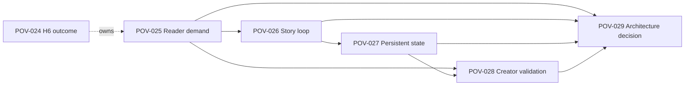
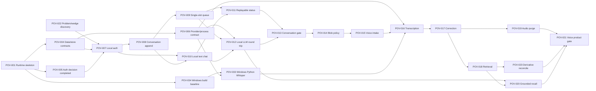

# Outcome Roadmap And Work Breakdown

Status: Planning baseline

Last reviewed: 2026-07-27

## Roadmap Policy

이 roadmap은 날짜나 기능 수를 약속하지 않습니다. 각 horizon은 사용자 또는 운영 outcome, 검증 증거와 진입 조건으로 닫습니다. 근접 실행 backlog는 첫 problem/wedge discovery와 voice recall product gate까지 상세화합니다. H3~H5 delivery는 앞 단계 학습 뒤 ticketize하고, H6는 장기 방향을 잃지 않도록 discovery·prototype·decision backlog만 미리 정의합니다.

제품 방향과 지표 정의는 [Product Strategy](PRODUCT_STRATEGY.md), 기술 경계는 [Architecture](ARCHITECTURE.md), 현재 실행 상태는 [TODO](TODO.md)를 따릅니다.

## Outcome Roadmap

| Horizon | Desired outcome | Success evidence | Delivery |
| --- | --- | --- | --- |
| H-1 — Problem and wedge evidence | first segment가 겪는 capture/recall 문제와 voice-first 해결 가설을 구현 전에 확인 | current alternative, voice/text friction, correction/source trust와 purge expectation을 직접 evidence로 구분하고 proceed/narrow/pivot/stop 결정 | [POV-022](tickets/POV-022-first-segment-and-voice-wedge-discovery-gate.md) |
| H0 — Reproducible local boundary | 기여자가 clean checkout에서 offline shell과 안전한 data/process contract를 재현 | same-origin local shell, 실제 validation command, owner/source/revision/store/auth boundary와 safe process contract가 executable evidence를 가짐 | [POV-001 completed](deps/POV-001-local-offline-walking-skeleton.md), [POV-004 completed](deps/POV-004-core-data-identity-and-store-boundaries.md), [POV-005 completed](deps/POV-005-authentication-and-session-security-decision.md), [POV-006 completed](deps/POV-006-provider-ports-and-safe-process-supervisor.md), [POV-034 completed](deps/POV-034-restore-windows-workspace-validation-baseline.md) |
| H1 — Trustworthy text capture | 한 owner가 인터넷 없이 로그인하고 text를 durable하게 남기며 retry와 긴 작업 상태를 신뢰 | POV-022 진행 결정, cross-owner·duplicate event 0, global RUNNING 1, reconnect 후 durable status 유지, local text round trip evidence gate 통과 | POV-007~013 |
| H2 — Correctable voice recall | 사용자가 음성을 남기고 전사를 교정한 뒤 현재 revision과 source를 근거로 다시 찾으며 raw audio는 정책대로 만료 | stale/deleted source 노출 0, current revision 정확성, accepted purge grace 밖의 due audio 0, versioned Korean evaluation과 dogfood gate 통과 | [POV-002](tickets/POV-002-voice-lifelog-round-trip.md), POV-014~021, POV-023, POV-033 |
| H3 — Trusted daily knowledge | 사용자가 note, daily task, worklog와 memory candidate를 외부 메모 앱 없이 안전하게 관리 | mutation readback, unrelated field 보존, duplicate worklog 0, 승인 없는 memory 승격 0, 반복 verified recall 증가 | H2 product gate 뒤 ticketize |
| H4 — Internal time continuity | 사용자가 외부 Calendar 없이 event를 조회·변경하고 daily task와 일정의 차이를 신뢰 | 명확한 CRUD 성공, 모호한 다중 대상 오변경 0, task/calendar 자동 혼합 0, timezone·revision 검증 | H3 evidence와 recurrence decision 뒤 ticketize |
| H5 — Safe product access and recovery | local 가치를 보존하면서 PWA, explicit export/delete, backup/restore와 선택적 remote ingress를 사용 | personal data cache 0, restore drill 성공, origin 직접 노출 0, Cloudflare 장애 중 local flow 유지 | local product value, recovery policy와 threat review 뒤 ticketize |
| H6 — Persistent playable story continuity | 독자가 연재형 세계의 주인공으로 선택하고 관계·세계 상태·발견·엔딩 조건을 회차 사이에 이어 가며 자신이 진행한 이야기로 돌아옴 | reader가 generic chat과 다른 회차형 가치를 행동으로 보이고, 선택의 후속 효과와 reference state continuity가 검증되며 creator 및 architecture gate가 명시적 결정으로 닫힘 | [POV-024 epic](tickets/POV-024-storyworld-follow-on-outcome.md), POV-025~029 strategic backlog |

## Gated Opportunities

다음 항목은 roadmap commitment가 아닙니다.

- multiple local workers: measured queue wait와 reference-device 병목이 single-slot 한계를 넘을 때
- PostgreSQL 또는 vector adapter: agreed data size, concurrency 또는 P95 threshold를 넘을 때
- daily/weekly compaction과 search-quality tuning: 실제 corpus와 versioned regression evidence가 생길 때
- web search와 image generation: core memory를 오염시키지 않는 allowlist, quota, approval와 retention policy가 있을 때

## Urgent Repository Safety Interlock

이 maintenance track은 product horizon을 바꾸지 않지만 H1 auth activation, project-license
finalization과 public visibility review보다 먼저 닫습니다. Temporary private 전환은
containment이며 history/cache cleanup의 완료 증거가 아닙니다.

| Order | Ticket | Status | Depends on | Reviewable outcome |
| --- | --- | --- | --- | --- |
| S0 | [POV-034 Restore Windows workspace validation baseline](deps/POV-034-restore-windows-workspace-validation-baseline.md) | Completed | POV-001 | Unix auth maintenance 경계를 활성화하지 않고 Windows `pov-core`/workspace compile·test baseline 복구 |
| S1 | [POV-031 Remove password blocklist feature](deps/POV-031-remove-password-blocklist-feature.md) | Completed — 2026-07-27 | POV-034 completed, POV-005, POV-007 current contract | ADR-0005 Accepted, current tree corpus/updater/enforcement 제거와 immutable migration 기반 sentinel/legacy compatibility 검증 |
| S2 | [POV-032 Purge password blocklist history and caches](tickets/POV-032-purge-password-blocklist-history-and-caches.md) | Planned; POV-031 completed, destructive execution needs explicit approval | POV-031 completed, repository private | affected refs/history 제거와 GitHub/search/archive residual evidence |
| S3 | Project license review | Decision gate | POV-031 current-tree third-party inventory completed | project-owned MIT 범위, dependency-owned license metadata와 contribution policy 결정 |
| S4 | Public visibility review | Decision gate | POV-032 residual review | private 유지 또는 public 재개를 별도 승인 |

POV-032의 history rewrite는 project license를 과거 third-party material에 소급 적용하지
않으며, public visibility는 S4 전까지 활성화하지 않습니다.

## H6 Follow-on Backlog

H6는 별도 제품 가설이 아니라 lifelogging 기반 이후의 후속 제품 방향입니다. 다만 아래 항목은 일정이 잡힌 delivery commitment가 아닙니다. H5 outcome evidence와 명시적 H6 roadmap priority 뒤에 POV-025를 활성화합니다. reader와 experience evidence가 없으면 다음 gate를 열지 않고, POV-029가 production 진입을 accepted하기 전에는 implementation ticket을 작성하지 않습니다.

| Order | Ticket | Type | Depends on | Reviewable outcome |
| --- | --- | --- | --- | --- |
| H6.0 | [POV-024 Storyworld follow-on outcome](tickets/POV-024-storyworld-follow-on-outcome.md) | Epic | — | reader-first outcome, non-goal과 evidence sequence를 한 backlog로 소유 |
| H6.1 | [POV-025 Reader demand and positioning](tickets/POV-025-storyworld-reader-demand-and-positioning.md) | Discovery gate | H5 outcome evidence와 H6 priority; child of POV-024 | generic chat이나 one-shot generation과 구분되는 회차형 reader demand 및 initial segment 결정 |
| H6.2 | [POV-026 Serialized story loop prototype](tickets/POV-026-serialized-story-loop-prototype.md) | Prototype gate | POV-025 `proceed`/`narrow` | 두 회차의 scene, choice, branch와 checkpoint/resume에서 playability 검증 |
| H6.3 | [POV-027 Persistent world state experience gate](tickets/POV-027-persistent-world-state-experience-gate.md) | Experience gate | POV-026 `proceed`/`narrow` | 관계·세계 상태·발견·ending condition의 reference-state continuity와 recovery 검증 |
| H6.4 | [POV-028 Creator authoring and monetization validation](tickets/POV-028-creator-authoring-and-monetization-validation.md) | Discovery gate | POV-025, POV-027 `proceed`/`narrow` | prompt가 아닌 playable world 제작 workflow, publishing 및 monetization 가설 검증 |
| H6.5 | [POV-029 Storyworld architecture and safety decision](tickets/POV-029-storyworld-architecture-and-safety-decision.md) | Decision gate | POV-025~028 each `proceed`/accepted `narrow` | account/data/runtime/safety/rights/cost/commerce 범위를 `proceed`, `narrow`, `defer` 또는 `stop`으로 결정 |

## Near-term Dependency Flow

## Executable Work Breakdown

| Order | Ticket | Type | Depends on | Reviewable outcome |
| --- | --- | --- | --- | --- |
| 1 | [POV-022 First segment and voice wedge discovery gate](tickets/POV-022-first-segment-and-voice-wedge-discovery-gate.md) | Discovery gate | — | first segment, voice/text capture, correction/source trust와 purge expectation을 저비용으로 검증 |
| 2 | [POV-001 Local offline walking skeleton](deps/POV-001-local-offline-walking-skeleton.md) | Completed delivery | — | Rust가 offline React shell과 health API를 loopback same-origin으로 제공 |
| 3 | [POV-004 Core data identity and store boundary contracts](deps/POV-004-core-data-identity-and-store-boundaries.md) | Completed delivery | POV-001 | owner/source/revision/correlation과 store lifecycle을 executable contract로 고정 |
| 4 | [POV-005 Authentication and session security decision](deps/POV-005-authentication-and-session-security-decision.md) | Completed decision | POV-001 | ADR-0004가 구현 전 인증·token·cookie·revoke 경계와 executable test matrix를 확정 |
| 5 | [POV-006 Provider ports and safe process supervisor](deps/POV-006-provider-ports-and-safe-process-supervisor.md) | Completed delivery | POV-001, POV-004 | model/media runtime을 replaceable port와 shell-free supervisor 뒤에 격리 |
| 6 | [POV-007 Local login, refresh and session revoke](tickets/POV-007-local-login-refresh-and-session-revoke.md) | In-progress delivery; auth schema, typed no-commit/fail-closed commit-uncertainty storage, credential primitive, canonical keyring와 pure initialization-transition metadata codec, owner-only maintenance actor, sentinel/legacy initialization reconciliation·rollback/forward recovery, exact source/final-CAS와 deletion-only cleanup implemented; Windows validation restored by POV-034 and POV-031 completed | POV-004, POV-005, POV-022 | 검증된 auth context가 owner scope를 강제; planned/retire/compromise/loss transition, production auth/JWT/HTTP/runtime은 미구현이고 activation은 POV-022에 gated |
| 7 | [POV-008 Idempotent conversation append and outbox](tickets/POV-008-idempotent-conversation-append-and-outbox.md) | In-progress delivery; persistence core implemented | POV-004, POV-007 | 입력이 retry와 embedding failure에도 하나의 durable source event로 남음 |
| 8 | [POV-009 Durable single-slot job queue](tickets/POV-009-durable-single-slot-job-queue.md) | In-progress delivery; durable persistence core implemented | POV-008 | outbox 기반 fixed-normal FIFO, fenced single-slot lease, 보수적 recovery halt와 retry/latency history를 복구; runtime activation은 POV-007/008/010~012/022에 gated |
| 9 | [POV-010 Minimal authenticated local text chat](tickets/POV-010-minimal-authenticated-local-text-chat.md) | Delivery | POV-007, POV-008 | 사용자가 offline Web Chat에서 text를 저장하고 durable receipt를 확인 |
| 10 | [POV-011 Authenticated replayable job status stream](tickets/POV-011-authenticated-replayable-job-status-stream.md) | Delivery | POV-009, POV-010 | token refresh와 reconnect 뒤에도 owner-scoped 상태를 이어 봄 |
| 11 | [POV-012 Loopback LLM text round trip](tickets/POV-012-loopback-llm-text-round-trip.md) | Delivery | POV-006, POV-009, POV-010 | local provider crash를 안전하게 드러내는 text inference 왕복 |
| 12 | [POV-013 Conversation Core offline evidence gate](tickets/POV-013-conversation-core-offline-evidence-gate.md) | Evidence gate | POV-004~012, POV-022 | offline, owner isolation, retry, reconnect와 process failure 증거로 H2 진입 여부 결정 |
| 13 | [POV-014 Temporary Blob lifecycle and privacy contract](tickets/POV-014-temporary-blob-lifecycle-and-privacy-contract.md) | Decision | POV-013 | 실제 voice intake 전에 encryption, retention, quota와 irreversible purge 경계를 확정 |
| 14 | [POV-015 Authenticated idempotent voice intake](tickets/POV-015-authenticated-idempotent-voice-intake.md) | Delivery | POV-013, POV-014 | 큰 음성을 재시도해도 media와 job 하나만 만들고 즉시 접수 |
| 15 | [POV-033 Windows Python Whisper turbo provider](tickets/POV-033-windows-python-whisper-turbo-provider.md) | Delivery | POV-006, POV-034 | Windows에서 Python Whisper를 shell 우회 없이 격리하고 runtime/model provenance를 검증 |
| 16 | [POV-016 Supervised audio normalization and transcription](tickets/POV-016-supervised-audio-normalization-and-transcription.md) | Delivery | POV-006, POV-015, POV-033 | cancel/timeout 뒤 orphan 없이 transcript source revision을 생성 |
| 17 | [POV-017 Immutable transcript correction revisions](tickets/POV-017-immutable-transcript-correction-revisions.md) | Delivery | POV-004, POV-016 | 사용자 교정을 덮어쓰기 없이 current revision으로 기록 |
| 18 | [POV-018 Current-revision hybrid transcript retrieval](tickets/POV-018-current-revision-hybrid-transcript-retrieval.md) | Delivery | POV-006, POV-008, POV-009, POV-017 | current source만 FTS/vector 후보로 검색하고 derivative를 재생성 |
| 19 | [POV-019 Retry-safe audio purge](tickets/POV-019-retry-safe-audio-purge.md) | Delivery | POV-014~017 | accepted grace 밖의 due raw audio를 제거하면서 transcript와 source hash를 보존 |
| 20 | [POV-023 Source and derivative reconciliation](tickets/POV-023-source-derivative-reconciliation.md) | Delivery | POV-008, POV-009, POV-017, POV-018 | missing/stale/duplicate derivative를 source authority로 탐지하고 repair/exclude |
| 21 | [POV-020 Evidence-grounded next-day recall](tickets/POV-020-evidence-grounded-next-day-recall.md) | Delivery | POV-012, POV-018 | current transcript source와 revision을 표시하며 근거 부족 시 추측하지 않음 |
| 22 | [POV-021 Voice round trip evidence gate](tickets/POV-021-voice-round-trip-evidence-gate.md) | Evidence gate | POV-015~020, POV-023 | versioned evaluation과 dogfood evidence로 H2를 ship, narrow 또는 stop 결정 |

`POV-002`는 H2 전체 outcome을 소유하는 epic이며 POV-014~021, POV-023과 POV-033을
child로 둡니다. 각 ticket은 구현 직전에 현재 manifest, active decision과 선행 ticket
evidence를 다시 읽고 Ready 여부를 판단합니다.

## Decision Gates

- POV-031 구현 선행 조건: [POV-034](deps/POV-034-restore-windows-workspace-validation-baseline.md) Windows baseline과 [ADR-0005](decisions/0005-password-blocklist-removal-and-legacy-auth-compatibility.md) Accepted 충족; [POV-031](deps/POV-031-remove-password-blocklist-feature.md) 완료
- H1 delivery 시작 전: POV-022에서 first segment와 voice wedge를 proceed 또는 좁은 scope로 확인
- POV-007 production activation 전: ADR-0005/POV-031 gate 완료; 남은 POV-022와 POV-007 수용 기준 검증
- project-license 결정 전: 완료된 POV-031 current-tree inventory를 검토
- public visibility 재개 전: POV-032 history/cache residual과 detached fork/clone 한계를 검토
- authentication 구현 전: [ADR-0004](decisions/0004-local-authentication-and-session-security-contract.md) Accepted
- 실제 voice Blob 저장 전: POV-014의 encryption, retention, quota와 purge contract accepted
- model artifact를 release default로 만들기 전: versioned quality threshold, artifact hash와 rollback 기준 고정
- H3 ticket 작성 전: POV-021에서 voice wedge의 value, usability와 operational evidence 검토
- Calendar 구현 전: recurrence, multi-day event, notification과 timezone 최소 범위 결정
- remote ingress 전: backup/restore, session, Cloudflare와 cache threat review 통과
- H6 activation 전: H5 outcome evidence 검토와 명시적 roadmap prioritization
- H6 story-loop prototype 전: POV-025가 `proceed` 또는 accepted `narrow`
- H6 creator validation 전: POV-027 continuity gate가 `proceed` 또는 accepted `narrow`
- POV-029 전: POV-025~028이 각각 `proceed` 또는 accepted `narrow`; upstream `pivot`/`stop`이면 POV-024 disposition으로 종료
- storyworld production backlog 전: POV-029 architecture/safety decision이 production 진입을 accepted
- personal lifelog를 storyworld에 사용하기 전: default-off opt-in, purpose limitation, isolation, revocation, deletion과 retention을 새 ADR로 결정

## Roadmap Change Rule

outcome, first segment, North Star, H6 direction, local/source-of-truth boundary가 바뀌면 [Product Strategy](PRODUCT_STRATEGY.md)와 ADR을 먼저 갱신합니다. ticket 순서만 바뀌면 이 문서, [TODO](TODO.md)와 해당 ticket dependency를 같은 변경에서 맞춥니다.
